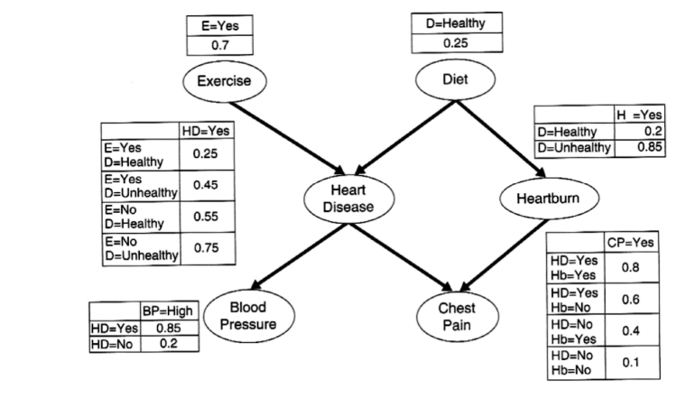

# Jawaban LKP 11
## 1. Jika diketahui bahwa pasien memiliki High Blood Pressure. Berapa peluang pasien itu menderita Heart Disease?

Misalkan Blood Pressure = BP , Heart Disease = HD, Exercise = E, Disease = D.

Maka untuk mencari peluang `P(HD|BP)` dapat menggunakan rumus : 

$$
P(HD \mid BP) = \frac{P(BP \mid HD)\cdot P(HD)}{P(BP)}
$$

Sehingga kita akan mencari variabel yang diperlukan yakni

$$
P(BP) = P(BP \mid HD)\cdot P(HD) + P(BP \mid \neg HD)\cdot P(\neg HD)
$$

$$
\begin{aligned}
P(HD) = &P(HD \mid E,D)\cdot P(E)\cdot P(D)\\
&+ P(HD \mid E,\neg D)\cdot P(E)\cdot P(\neg D)\\
&+ P(HD \mid \neg E,D)\cdot P(\neg E)\cdot P(D)\\
&+ P(HD \mid \neg E,\neg D)\cdot P(\neg E)\cdot P(\neg D)
\end{aligned}
$$

$$
P(\neg HD) = 1 - P(HD)
$$

Dari gambar bayesian network diatas kita dapat mengetahui bahwa:

| Variabel        | Nilai |
|-----------------|-------|
| $P(E)$          | 0.7   |
| $P(\neg E)$     | 0.3   |
| $P(D)$          | 0.25  |
| $P(\neg D)$     | 0.75  |
| $P(HD \mid E,D)$ | 0.25 |
| $P(HD \mid E,\neg D)$| 0.45|
| $P(HD \mid \neg E,D)$| 0.55|
| $P(HD \mid \neg E,\neg D)$| 0.75|
| $P(BP \mid HD)$ | 0.85|
| $P(BP \mid \neg HD)$| 0.2|

Sehingga didapatkan hasil

$$
P(HD) = 0.25 \cdot 0.7 \cdot 0.25 + 0.45 \cdot 0.7 \cdot 0.75 + 0.55 \cdot 0.3 \cdot 0.25 + 0.75 \cdot 0.3 \cdot 0.75 = 0.49\\
$$

$$
P(\neg HD) = 1 - 0.49 = 0.51
$$

$$
P(BP) = 0.85 \cdot 0.49 + 0.2 \cdot 0.51 = 0.5185
$$

maka dapat dihitung peluang `P(HD|BP)`

$$
P(HD \mid BP) = \frac{0.85 \cdot 0.49}{0.5185} = 0.80328
$$

Sehingga peluang seseorang terkena Heart Disease dengan diketahui ia memiliki high blood pressure adalah **0.80328**
